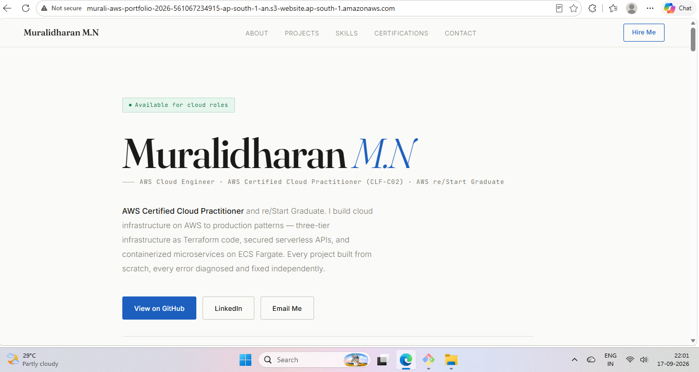
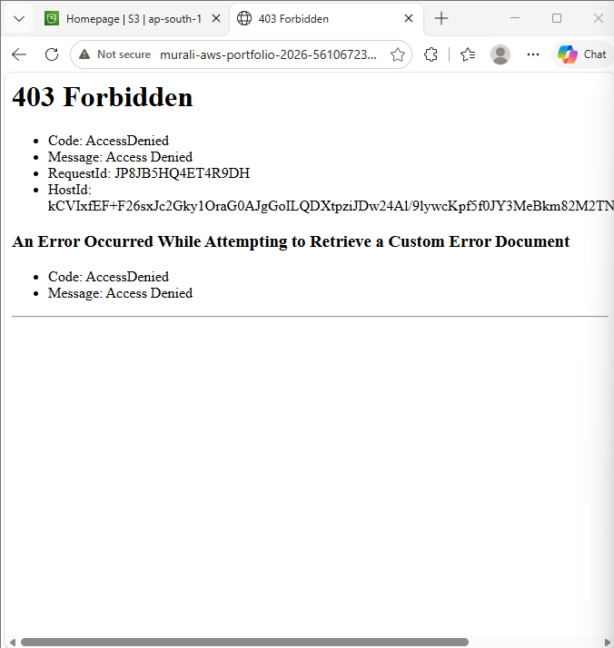
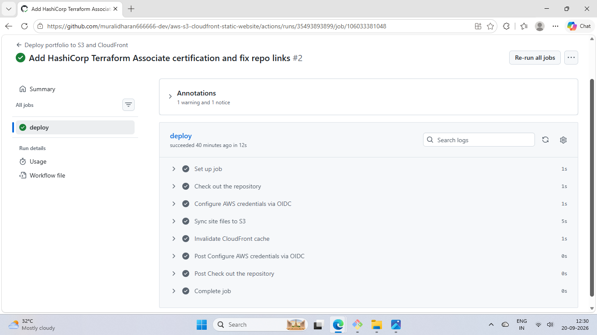
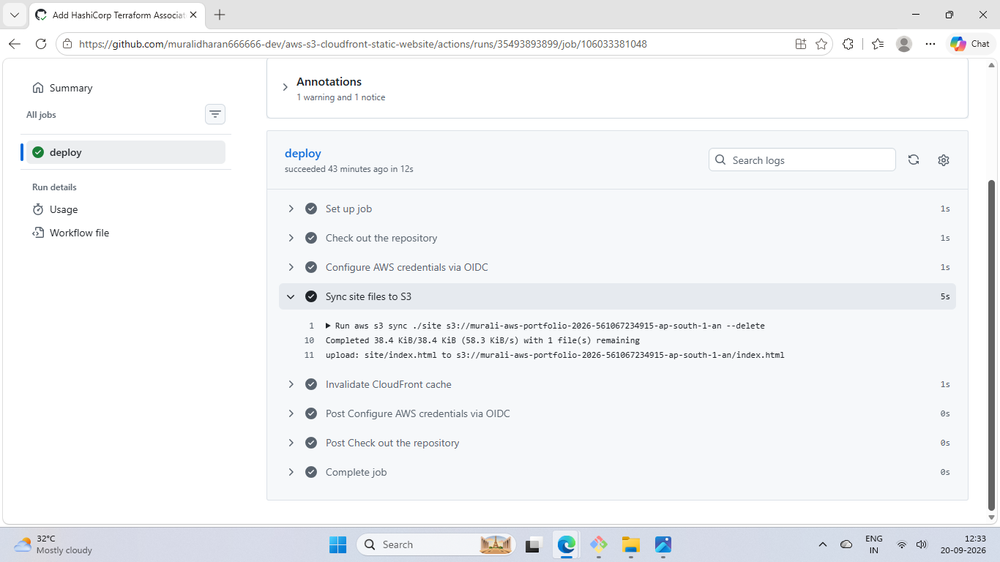

# Hosting My Portfolio on AWS — S3 + CloudFront

I wanted to move my portfolio off a free hosting platform and actually deploy it properly using AWS. My goal was to understand how S3 and CloudFront work together, and how to restrict bucket access so the site is only reachable through the CDN and not directly from S3.

Later I added a GitHub Actions pipeline, so now every push to `main` deploys the site automatically.

**Live site:** https://d1gfj90rneo89i.cloudfront.net

---

## What I Built

A static portfolio site (a single `index.html` with the CSS and JS inside it) stored in a private S3 bucket and served through CloudFront. The bucket can't be reached directly. Every request has to go through the CloudFront distribution, which handles HTTPS and caching.

Deployments go through GitHub Actions. The workflow logs in to AWS with OIDC, so there are no AWS access keys stored anywhere in GitHub.

---

## AWS Services I Used

- **Amazon S3** — stores the website files in a private bucket. Block Public Access is on and static website hosting is off, because CloudFront reads from the bucket's REST endpoint through OAC.
- **Amazon CloudFront** — handles HTTPS and caching, and is the only thing allowed to read from the bucket. The default root object is set to `index.html` in CloudFront, so opening the domain with no file name still loads the homepage.
- **Origin Access Control (OAC)** — CloudFront signs every request it sends to S3. A **bucket policy** on the S3 bucket only allows `s3:GetObject` from my CloudFront distribution's ARN.
- **AWS IAM** — an OIDC identity provider for GitHub, plus one IAM role the pipeline assumes to deploy.
- **GitHub Actions** — deploys the site on every push to `main`.

---

## Architecture


User → CloudFront (HTTPS) → S3 bucket (private, read-only via OAC)

Deploy: git push → GitHub Actions → OIDC → IAM role → S3 sync + CloudFront invalidation

---

## What I Actually Did

### 1. Wrote the website
Started as a basic HTML/CSS/JS portfolio. Later I redesigned it into a single `index.html` with everything inline.

### 2. Created the S3 bucket and CloudFront distribution
Created the bucket in `ap-south-1` (Mumbai) and put a CloudFront distribution in front of it. My first version used the S3 static website endpoint as the CloudFront origin, which meant the bucket had to be publicly readable for it to work.

### 3. Found out my bucket was actually public
When I started building the CI/CD pipeline, I went through the real config instead of trusting what I'd written here. The CloudFront origin was the `s3-website` endpoint, Block Public Access was off, and the bucket policy had `"Principal": "*"`. I opened the S3 website URL directly and my whole site loaded over plain HTTP. This README said that URL returned 403. It didn't.

### 4. Moved it behind OAC without taking the site down
I did it in an order that kept the site up the whole time:

1. Set the **default root object** to `index.html` in CloudFront. The S3 REST endpoint has no index document feature, so without this the homepage would break after the switch.
2. Changed the origin from the `s3-website` endpoint to the S3 REST endpoint and attached an OAC with "sign requests".
3. **Added** a CloudFront-only statement to the bucket policy, next to the existing public one, and tested.
4. **Removed** the public statement and tested again.
5. Turned Block Public Access back on.
6. Disabled static website hosting, since nothing uses it anymore.

Adding the new rule before removing the old one was the key part. If I'd swapped them in one go and made a mistake, CloudFront would have lost access and the site would have gone down.

### 5. Verified it worked
- The CloudFront URL loads the site over HTTPS. With the public rule gone, that only works because the OAC-signed requests are accepted.
- Direct S3 access now returns **403 AccessDenied**. After I disabled website hosting, the old `s3-website` URL returns 404 `NoSuchWebsiteConfiguration`.

---

## CI/CD Pipeline (GitHub Actions)

Before this, updating the site meant uploading `index.html` in the S3 console and creating a CloudFront invalidation by hand. That's also how my repo fell out of date: I uploaded a redesign straight to S3 in July and never committed it. The first pipeline run would have overwritten the live site with the old version, so before building anything I downloaded the live file from S3 and committed it. The repo is now the source of truth.

The workflow is in `.github/workflows/deploy.yml`. On every push to `main` it:

1. Checks out the repo
2. Logs in to AWS with OIDC using `aws-actions/configure-aws-credentials`
3. Runs `aws s3 sync ./site s3://<bucket> --delete`
4. Runs `aws cloudfront create-invalidation --paths "/*"`

The website lives in a `site/` folder so that `sync --delete` only mirrors the website into the bucket, and not my README, screenshots and diagrams.

### How the AWS login works (no access keys)
I added `token.actions.githubusercontent.com` as an OIDC identity provider in IAM, with audience `sts.amazonaws.com`. When the workflow runs, GitHub gives it a short-lived signed token saying which repo and branch it came from. The workflow trades that token for temporary AWS credentials that last up to 1 hour. There's no access key in GitHub Secrets to leak or rotate. The workflow needs `permissions: id-token: write` for this to work.

### Locking the role to my repo
The OIDC provider only proves a token came from GitHub, not which repo. So the role's trust policy checks the token's `sub` claim:

```
repo:muralidharan666666-dev/aws-s3-cloudfront-static-website:ref:refs/heads/main
```

Only workflows from this repo, on the `main` branch, can assume the role. Any other repo, fork or branch gets refused.

### What the role can do
One inline policy with four actions, each scoped to one resource:

| Action | Resource | Why |
|---|---|---|
| `s3:ListBucket` | the bucket | `sync` needs to see what's already there |
| `s3:PutObject` | objects in the bucket (`/*`) | upload changed files |
| `s3:DeleteObject` | objects in the bucket (`/*`) | `--delete` removes files that aren't in the repo anymore |
| `cloudfront:CreateInvalidation` | my distribution only | clear the cache after deploying |

It can't change bucket policies, touch any other bucket, or modify the CloudFront distribution.

### Why the invalidation is needed
CloudFront caches the page at its edge locations. Without the invalidation, the new file would be in S3 but visitors could keep getting the old cached copy for up to 24 hours.

### Testing it
- **Run #1** was the commit that added the workflow. The repo already matched S3, so `sync` uploaded nothing. That run tested the OIDC login and permissions without changing the live site.
- **Run #2** was a real change: adding my HashiCorp Terraform Associate certification to the site. The log showed `upload: site/index.html to s3://...`, and the change was live within a minute. I never opened the AWS console.

---

## What I Learned

Building this project made me understand how real websites actually protect their content.
Every major website we use — Flipkart, Hotstar, Zomato — stores its images, videos and static files somewhere. That somewhere is usually a private storage bucket. We never access that bucket directly. We always go through their CDN without even knowing it. The bucket URL is never exposed. The CDN is the only door.
Before building this I did not understand why that separation existed. Now I do. If the bucket is public anyone who finds the URL can hit it directly — bypassing the CDN, bypassing any access control, bypassing everything. OAC is what enforces that separation. The bucket stays completely private and CloudFront is the only one with permission to read from it. No matter what, every request goes through CloudFront.
That one concept — keeping storage private and only exposing it through a controlled layer — is the foundation of how content is delivered securely on the internet.

Adding the pipeline taught me two more things. First, check what's actually configured instead of what you remember or wrote down. My own README was wrong about my own bucket. Second, once deploys are automated, the repo has to be the only source of truth. Uploading one file by hand is how my repo and my live site ended up out of sync.

---

## Screenshots

### Live site via CloudFront


### CloudFront distribution settings


### Original setup — S3 static website hosting (before moving to OAC)


### GitHub repo


### Before: direct S3 URL loaded the site over HTTP


### After: direct S3 URL returns 403


### Pipeline run — deploy succeeded


### Pipeline log — sync uploading the change


---

## Author

**Muralidharan M N**

AWS Certified Cloud Practitioner | HashiCorp Certified: Terraform Associate | AWS re/Start Graduate

LinkedIn: https://www.linkedin.com/in/muralidharan-m-n-78a2522b8

GitHub: https://github.com/muralidharan666666-dev
